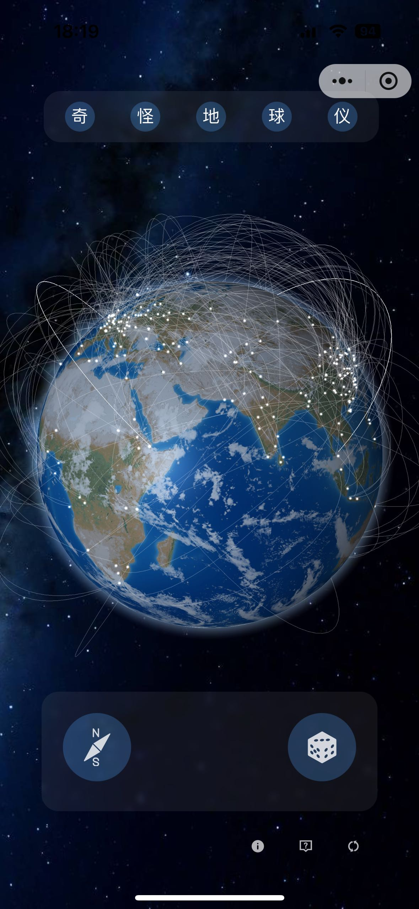
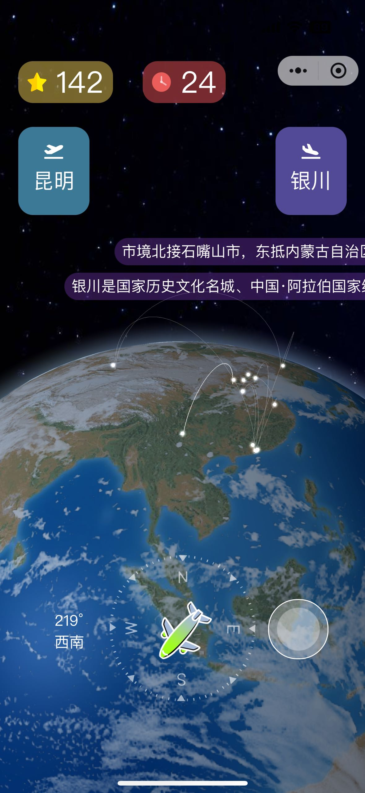
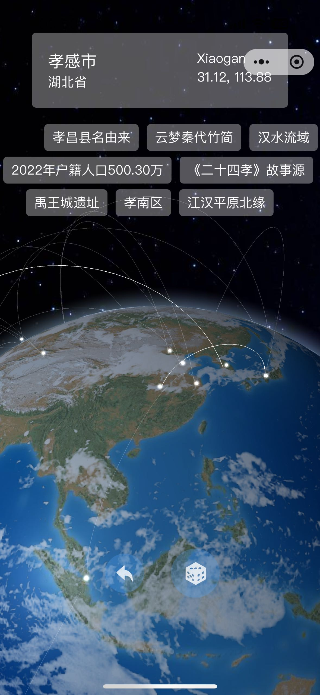
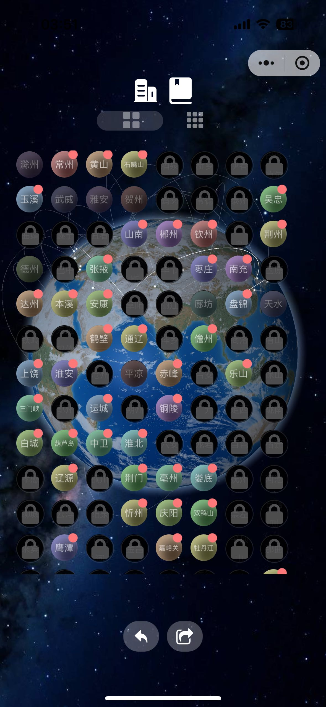
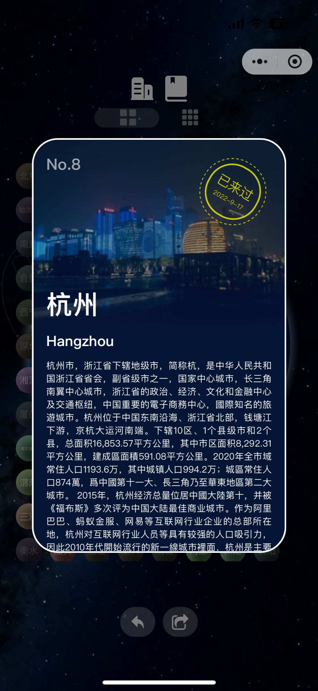
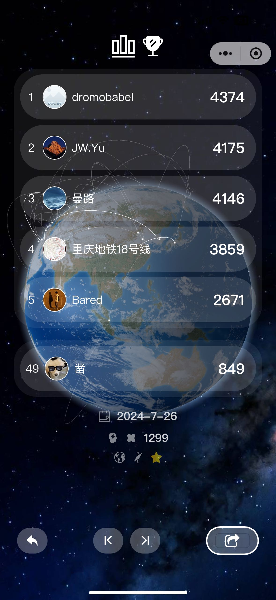

# WeChat Mini Program: Strange Globe

**Formerly Known As: Planet Lamp Lighter**

中文说明文档请点击这里：[中文版 Readme](./README_CN.md)

## Overview

A quirky knowledge-based mini program centered around geographical knowledge. It includes the following modules:
* **Direction Sense Trainer**: Only by correctly determining the direction from City A to City B can you keep moving forward, until you can no longer progress.
* **Random Destination Selector**: Randomly select a city on the globe and fly around randomly.
* **Footprint Reviewer (Under indefinite development)**: Choose all the places you've been to, generate your footprint map, and traveler's resume.

## Screenshots

<div style="display: flex; justify-content: space-between;flex-wrap: nowrap">



</div>

<div style="display: flex; justify-content: space-between;flex-wrap: nowrap">



</div>

## Online Experience  (Scan with Wechat)

<div style="display: flex; justify-content: center;flex-wrap: nowrap">

</div>

## Tech Stack

* uni-app
* three.js
* vue 2
* sass

## Project Setup Instructions

### 1. Environment Setup

Ensure that Node.js and Yarn are installed on your machine.

- [Node.js Download](http://nodejs.cn/download/)
- [Yarn Installation Guide](https://yarn.bootcss.com/docs/install/#mac-stable)

Also, download the WeChat Developer Tools:

- [WeChat Developer Tools](https://developers.weixin.qq.com/miniprogram/dev/devtools/download.html)

You can use either VSCode or HBuilder as your IDE.

### 2. Project Initialization

First, install the project's dependencies. Switch to the project directory in the command line and run:

```
yarn install
```

This will download all the dependencies to the `node_modules` folder. Now you can run the project. Execute the following command:

```
export NODE_OPTIONS=--openssl-legacy-provider // Sometimes needed
yarn run dev:mp-weixin
```

After running this, a new path will appear in your project:

```
dist/dev/mp-weixin
```

Use the WeChat Developer Tools to select this path and import it to enable hot updates.