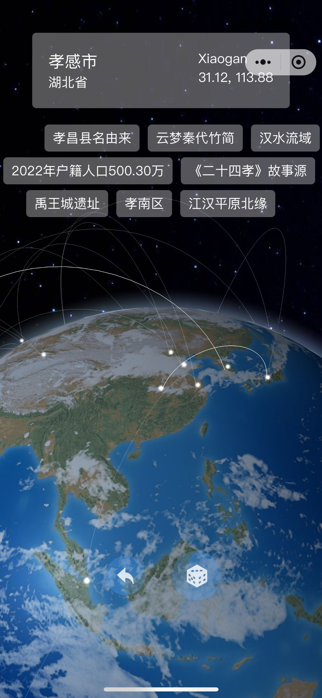
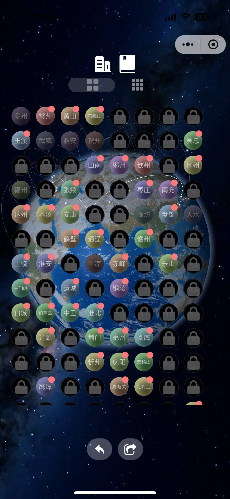
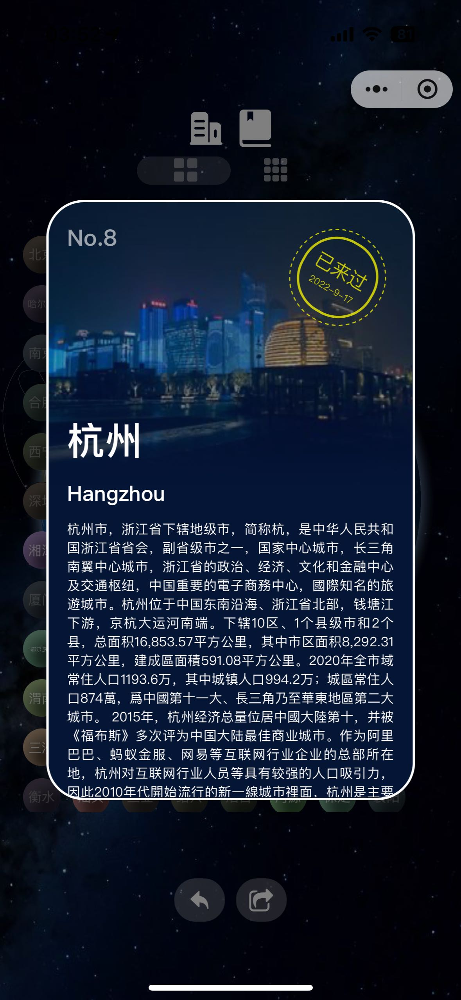
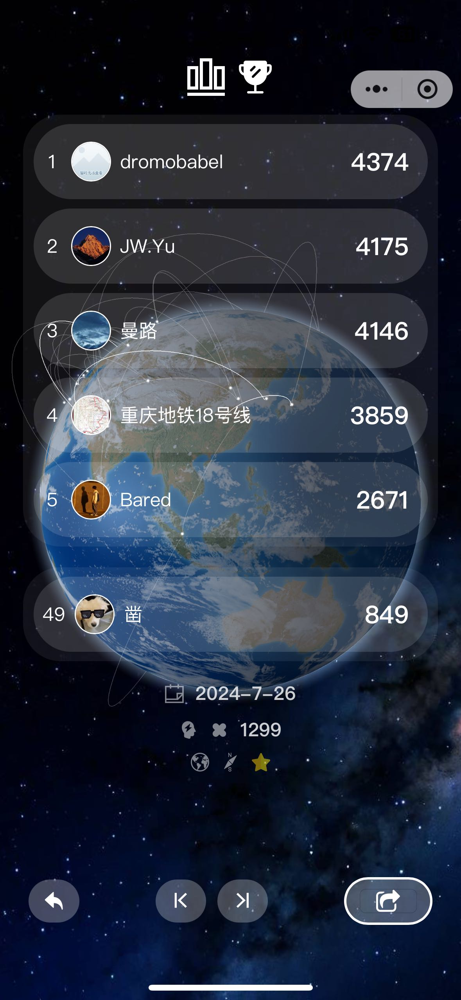

# 微信小程序：奇怪地球仪

曾用名：星球点灯人

## 简介

一款基于地理知识的比较奇怪的知识类小程序，有以下几个模块：
* 方向感训练器：只有正确判断从城市A到城市B的方位，才能持续前进，一直前进到不能再前进
* 目的地随机抽取器：随机抽取一个地球上的城市，然后胡乱飞，飞来飞去
* 足迹回顾器（无限期开发中）：选择去过的所有地方，生成我的足迹地图和旅行者履历

## 截图

<div style="display: flex; justify-content: space-between;flex-wrap: nowrap">



</div>

<div style="display: flex; justify-content: space-between;flex-wrap: nowrap">



</div>


## 线上体验

<div style="display: flex; justify-content: center;flex-wrap: nowrap">

</div>


## 技术栈

* uni-app
* three.js
* vue 2
* sass

## 项目启动方式

### 1.环境安装

首先要保证本机已经安装了node.js和yarn。

http://nodejs.cn/download/
https://yarn.bootcss.com/docs/install/#mac-stable

同时还要记得下载微信开发者工具：

https://developers.weixin.qq.com/miniprogram/dev/devtools/download.html

IDE用vscode或者hbuilder均可。

### 2.项目启动

首先安装这个项目的环境依赖。在命令行中切换到这个项目，然后运行
```
yarn install
```
这样我们这个项目的依赖就都被下载到了node_modules这个文件夹里，现在就可以运行项目了。
接下来我们就可以跑这个项目。运行下面这个命令：

```
export NODE_OPTIONS=--openssl-legacy-provider // Sometimes needed
yarn run dev:mp-weixin
```
运行完之后，我们可以看到问我们的项目里面多了下面这样一个路径：

```
dist/dev/mp-weixin
```

用微信开发者工具选择这个路径导入即可开启热更新。